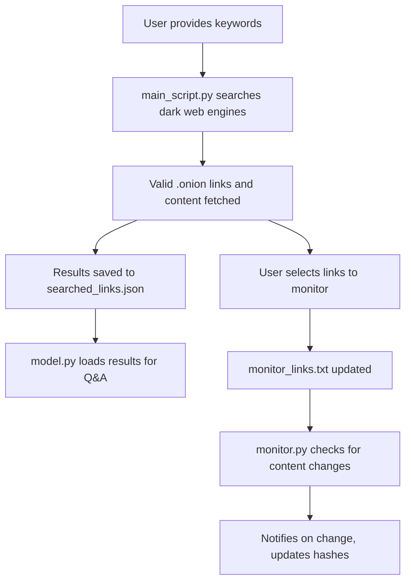

# Dark Web Search, Analysis, and Monitoring Toolkit

<details>
  <summary>Main_Script to crawl the darkweb</summary>

  
</details>

<details>
  <summary>Model Conversations</summary>

  
</details>

A comprehensive Python-based solution for searching, analyzing, and monitoring .onion (dark web) sites using the Tor network. This toolkit enables ethical cybersecurity researchers and analysts to explore the hidden web with anonymity and automation.

---

## 📃 Table of Contents

* [Features](#-features)
* [Architecture & Workflow](#-architecture--workflow)
* [Directory Structure](#-directory-structure)
* [Installation](#-installation)
* [Usage](#-usage)
* [Advanced Details](#-advanced-details)
* [Troubleshooting](#-troubleshooting)
* [License & Disclaimer](#-license--disclaimer)

---

## 🚀 Features

* **Dark Web Keyword Search:** Retrieves .onion links using dark web search engines.
* **Content Validation & Extraction:** Ensures availability and extracts page content.
* **LLM-Powered Analysis:** Interact via Q\&A using Hugging Face's Mistral-7B model.
* **Change Monitoring:** Tracks and notifies on content updates across selected links.
* **Tor Integration:** All traffic routed via the Tor network for maximum anonymity.

---

## 🛠️ Architecture & Workflow



---

## 📂 Directory Structure

```bash
project_root/
├── main_script.py         # Search and collect .onion links
├── model.py               # Q&A analysis on collected content
├── monitor.py             # Monitor .onion links for changes
├── torrc                  # Tor configuration file
└── test_files/
    ├── keywords.txt           # List of search keywords
    ├── searched_links.json    # Collected search results
    ├── main.log               # Log for main_script.py
    ├── skipped_links.log      # Skipped or invalid links
    ├── monitor_links.txt      # Links to monitor
    ├── monitor_hashes.json    # Content hashes for change detection
    └── monitor.log            # Log for monitor.py
```

---

## 🚪 Installation

### Prerequisites

* Python 3.8+
* Tor (running locally)
* pip (Python package manager)

### Python Dependencies

```bash
pip install requests beautifulsoup4 stem
```

### Tor Configuration

Use the following `torrc` settings:

```conf
ControlPort 127.0.0.1:9051
CookieAuthentication 1
SocksPort 127.0.0.1:9050
```

Place `torrc` in your Tor config directory or launch Tor with these parameters.

### Hugging Face API Key (For `model.py`)

Get it from: [https://huggingface.co/settings/tokens](https://huggingface.co/settings/tokens)

```bash
export HF_API_KEY=your_hf_api_key
```

---

## ⚡ Usage

### Step 1: Search and Fetch

```bash
python main_script.py
```

* Uses `keywords.txt` for input.
* Outputs to `searched_links.json`.

### Step 2: Analyze with LLM

```bash
python model.py
```

* Choose a keyword & result to question.
* Powered by Hugging Face's Mistral-7B.

### Step 3: Monitor Changes

```bash
python monitor.py
```

* Reads links from `monitor_links.txt`.
* Logs changes in `monitor.log`.

---

## 🪄 Advanced Details

* **Concurrency:** `main_script.py` uses threads for parallel link checking.
* **Tor Identity Rotation:** Scripts issue NEWNYM signals to avoid IP rate-limits.
* **Error Logging:** Skipped links and errors are separately logged.
* **Extensibility:** Easily add new search engines or models.

---

## 🚧 Troubleshooting

| Problem         | Solution                                                   |
| --------------- | ---------------------------------------------------------- |
| Tor not running | Start Tor and ensure correct `torrc` setup                 |
| No results      | Check keywords and network accessibility                   |
| API errors      | Verify Hugging Face token access & model availability      |
| File I/O errors | Ensure scripts have permissions in `test_files/` directory |

---
## 📜 License

**This project is proprietary and strictly confidential. Unauthorized use, reproduction, distribution, or modification is strictly prohibited and will result in legal action. All rights reserved. See the [LICENSE](https://github.com/Nischaya008/ResumifyNG/blob/main/LICENSE) for details.**


---

## ⚖️ Legal & Ethical Use Statement
**This project is strictly intended for educational, research, and technical demonstration purposes only. I do not endorse, promote, or engage in any illegal activities, nor do I condone misuse of the dark web or its services. Any actions taken using this toolkit are the sole responsibility of the end user. I, as the creator, disclaim all liability for any unlawful use, and I strongly urge compliance with all applicable laws and ethical guidelines. Use responsibly, at your own risk.**

---

## 📞 Contact
For any inquiries or feedback, reach out via:
- 📧 Email: nischayagarg008@gmail.com
- 🐦 Twitter: [@Nischaya008](https://x.com/Nischaya008)
- 💼 LinkedIn: [Nischaya Garg](https://www.linkedin.com/in/nischaya008/)

### ⭐ Star this repository if you find it useful! 😊

Stay Innovated, Keep Coding, Think BIG! 🚀
